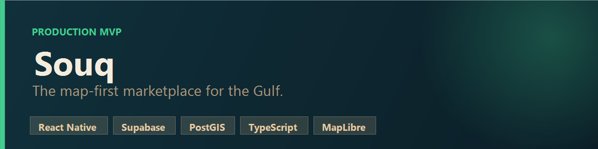
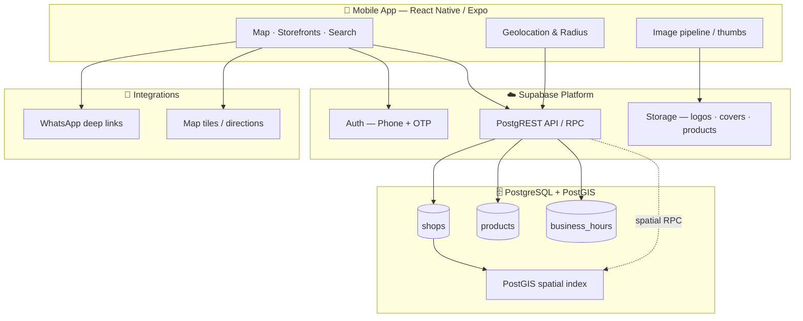
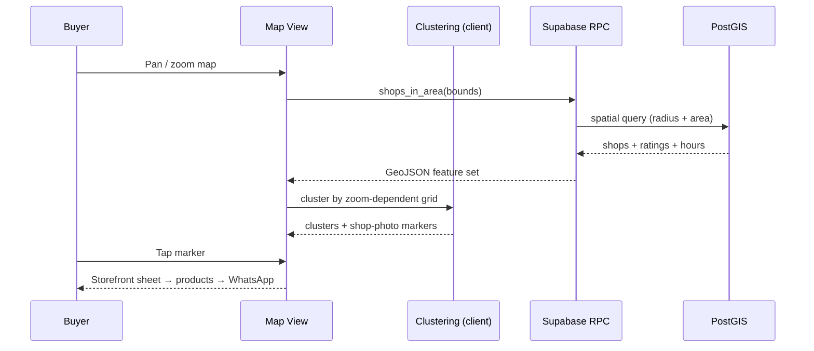
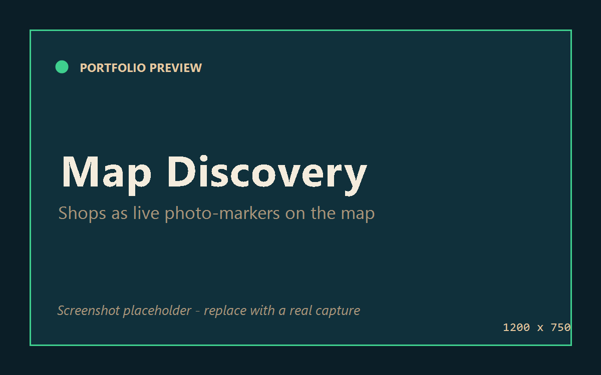
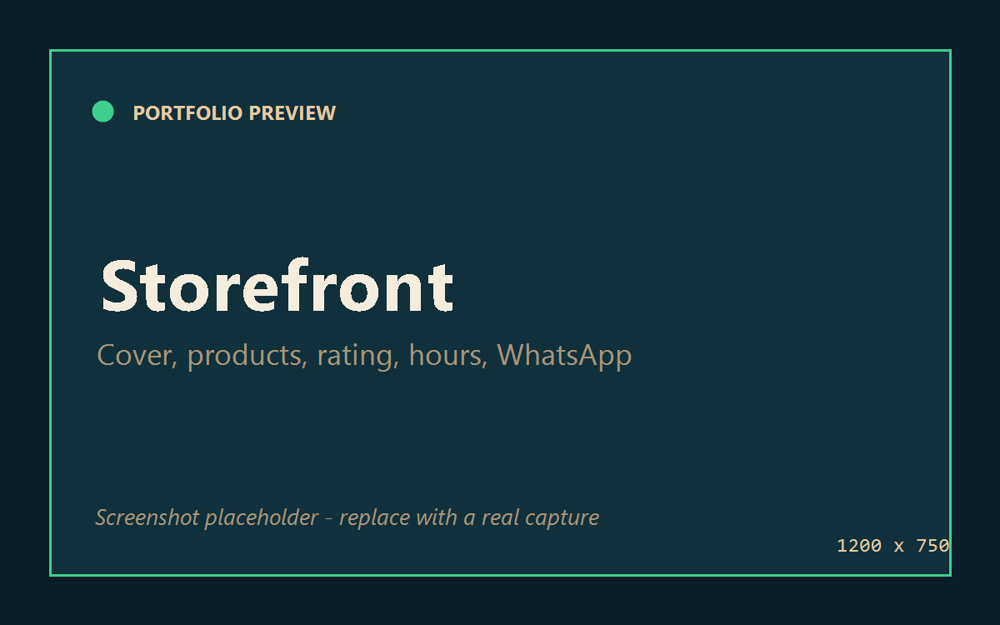
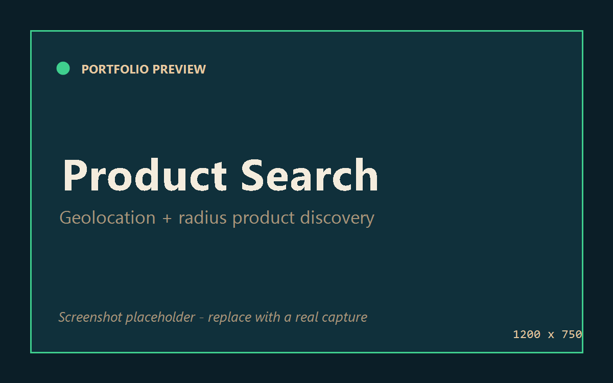
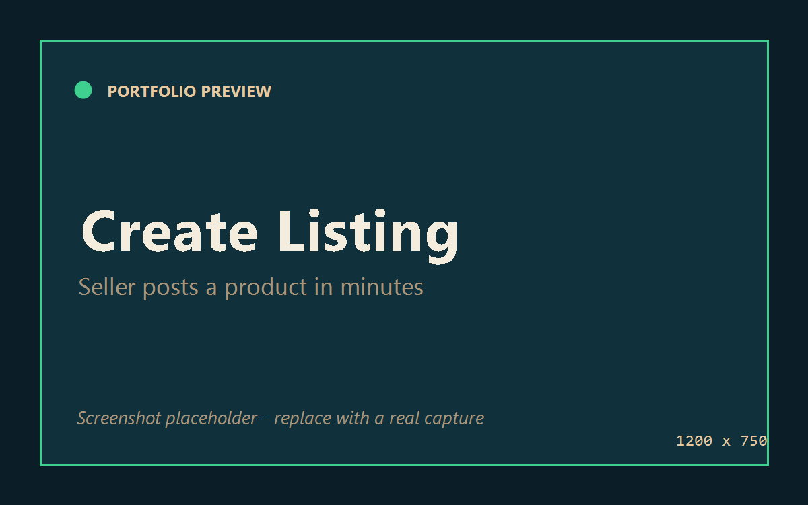
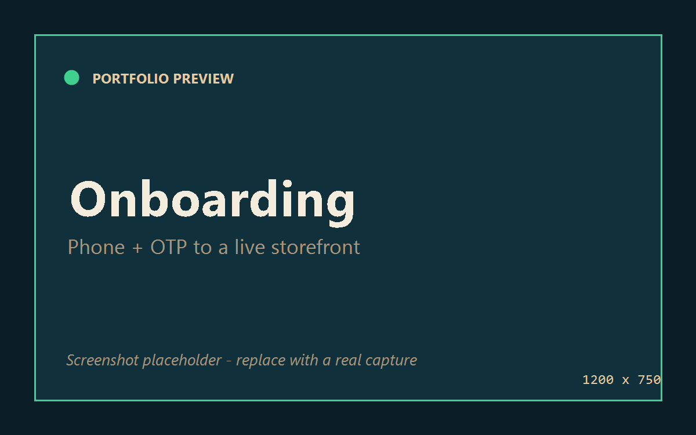
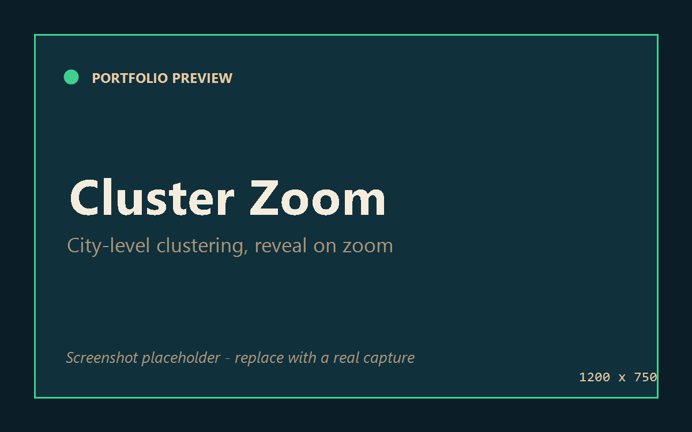
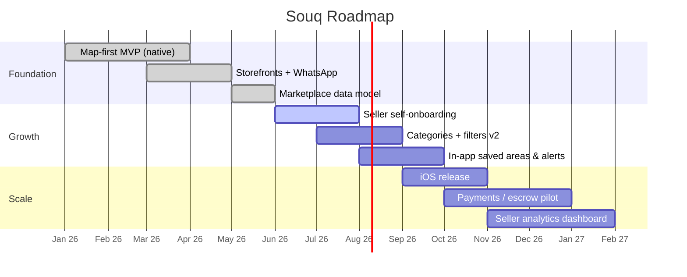

<div align="center">



# 🛒 Souq

### The map-first marketplace for the Gulf.

*Discover shops, freelancers and independent sellers around you — on a living map, not a list.*

[](#-development-status)
[](#-tech-stack)


</div>

> **Public portfolio repository.** This repo documents Souq's architecture, design, and roadmap. The application source is proprietary and kept private. For a code walkthrough under NDA, reach out: **arasghorbani9090@gmail.com**.

---

## 📖 Overview

Across the Gulf, an enormous amount of commerce happens informally — through WhatsApp, Instagram pages, word of mouth, and physical shops you only find by walking past them. There's no single place to **discover what's for sale around you**.

**Souq** turns the map itself into the marketplace. Open the app and you see real storefronts as profile-image markers pinned to where they actually are. Tap one to view its products, ratings, and hours, then message the seller directly on WhatsApp. Sellers — whether a registered shop, a freelancer, or someone selling from home — get a storefront in minutes, no website required.

**Who it's for**
- 🛍 **Buyers** — find shops, services, and items near them, filtered by category and radius.
- 🏪 **Shops** — a discoverable storefront with products, hours, and one-tap contact.
- 🧑‍🔧 **Service providers & independent sellers** — a presence on the map without building a website.

---

## ✨ Features

- 🗺 **Map-first discovery** — native MapLibre map where every seller is a circular shop-photo marker, clustered at city zoom and revealed individually as you zoom in.
- 🔍 **Geolocation product search** — search products and shops within an adjustable radius; "My Areas" lets buyers pin the neighborhoods they care about.
- 🏬 **Storefronts** — each seller gets a cover, logo, rating, working hours, and a product grid — a shareable mini-shop.
- 💬 **WhatsApp-native contact** — buyers reach sellers through the channel Gulf commerce already runs on; one tap, pre-filled message.
- 🧭 **Open-now & directions** — live open/closed status from business hours, plus one-tap directions.
- 👤 **Three account types** — shops, service providers, and independent sellers, each surfaced with the right badges and UX.
- 📱 **Fast onboarding** — phone + OTP, designed so a seller goes from install to a live listing in minutes.
- ⚡ **Native performance** — built on the New Architecture (Fabric/Hermes) for smooth map interaction on real devices.

---

## 🏗 Architecture



### Map rendering pipeline



---

## 🧱 Tech Stack

| Layer | Technology |
| --- | --- |
| **Mobile** | React Native, Expo (SDK 56), TypeScript, New Architecture (Fabric + Hermes) |
| **Maps** | MapLibre (native), client-side geo-grid clustering, custom photo markers |
| **Backend** | Supabase — PostgREST, Auth (phone/OTP), Storage, Edge functions |
| **Database** | PostgreSQL + PostGIS (spatial indexing, radius & area queries, RPC) |
| **Integrations** | WhatsApp deep linking, native maps / directions |
| **Tooling** | EAS / local Gradle release builds, signed Android APK distribution |

---

## 📂 Folder Structure

> Representative structure — illustrative of organization, not a source dump.

```
souq/
├── app/                      # React Native / Expo application
│   ├── src/
│   │   ├── screens/          # Map, Search, Storefront, Create Listing, Onboarding
│   │   ├── components/       # MapShopSheet, StorefrontModal, ProductCard, Icon
│   │   ├── data/             # shops, products, storefront — typed data access
│   │   ├── map/              # map modes, styles, clustering helpers
│   │   ├── lib/              # geolocation, image URLs, maps/deeplinks
│   │   └── theme/            # design tokens
│   └── android/              # native Android project (release builds)
├── supabase/
│   ├── migrations/           # schema, spatial RPCs, marketplace data model
│   └── seed/                 # data generation for demo ecosystems
└── docs/                     # architecture & design notes
```

---

## 🖼 Screenshots

> Placeholders — drop real captures into `docs/screenshots/` and they'll render here.

| Map discovery | Storefront | Product search |
| --- | --- | --- |
|  |  |  |

| Create listing | Onboarding | Cluster zoom |
| --- | --- | --- |
|  |  |  |

---

## 🗺 Roadmap



- [x] Native map-first MVP on Android (real-device verified)
- [x] Storefronts, ratings, business hours, open-now
- [x] WhatsApp-native contact + directions
- [x] Geolocation product search + radius / My Areas
- [ ] Frictionless seller self-onboarding (phone/OTP → live listing)
- [ ] Category taxonomy & advanced filters
- [ ] iOS release
- [ ] Payments / escrow pilot
- [ ] Seller analytics

---

## 📈 Development Status

🟢 **Production MVP** — running on native Android, tested on real devices, backed by a live PostGIS database with a full marketplace data model. Actively building seller onboarding and preparing iOS.

---

## 🤝 For Partners

Souq is founder-built and shipping. If you're an **investor, accelerator, technical co-founder, or engineer** interested in Gulf-region commerce infrastructure:

📧 **arasghorbani9090@gmail.com** · 🔗 [LinkedIn](https://www.linkedin.com/in/aras-ghorbani-ab1a7b62)

<div align="center"><sub>© Souq. Architecture & docs are public; application source is proprietary.</sub></div>

## Source Code

The production source code is maintained in a private repository. The portfolio repository demonstrates the architecture, features, and technical design. Source code can be shared for employment or collaboration opportunities under appropriate confidentiality terms.
